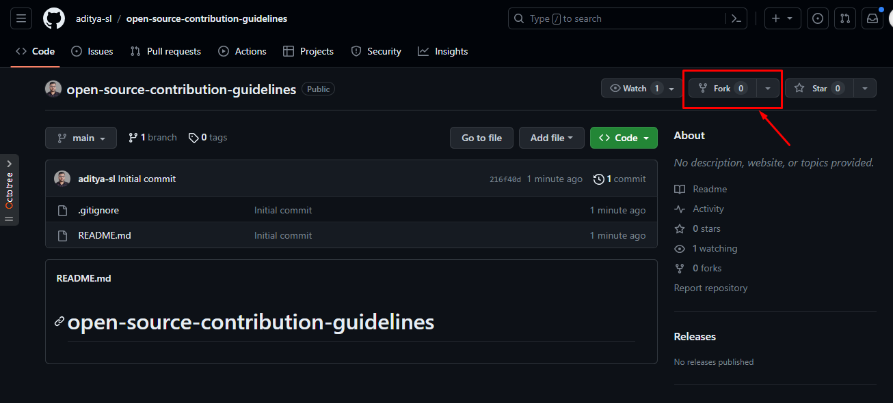
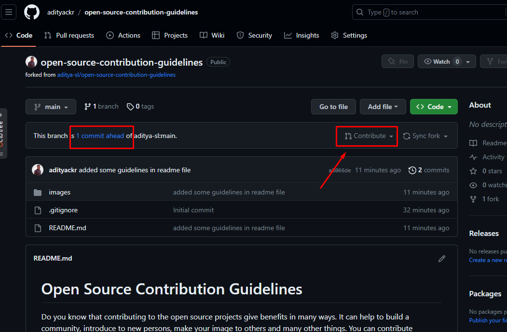
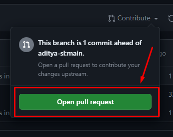

# Open Source Contribution Guidelines

Do you know that contributing to the open source projects give benefits in many ways. It can help to build a community, introduce to new persons, make your image to others and many other things. You can contribute anything to an open source projects such as spelling correction, commenting some codes, writing markdown files, finding errors in code and fixing, debugging the buggy codes etc. Here you will find some guidelines how to contribute an open source projects.

- First find an open source repository.
- Fork the repository.
  
- Copy the repository link.
  
- Clone the repository by writing following command

```shell
git clone [YOUR FORKED REPOSITORY NAME]
```

In my case

```shell
git clone https://github.com/adityackr/open-source-contribution-guidelines.git
```

- Change according to your findings
- Commit and push the changes to your repository
- Go to your repository and click the contribute button.



- Click the `Open Pull Request` button.



- Now write a message to the maintainer of the main repository such as what you have changed, why it is necessary, any relevant source etc.
- After writing message click `Create Pull Request` button. A pull request will send to the maintainers of the main repo.
- Then they will review your changes. If they have any comment they will comment on the request. You have to follow-up that comment and do what they have requested.
- After reviewing if all is ok, they will merge your request with their branch. And you have successfully contributed to an open source project.
- Keep your eyes on to the project. If they update the project you will try to find something to contribute again.

By following these guidelines you can contribute to as many as open source projects you want. Try to contribute to open source projects.
